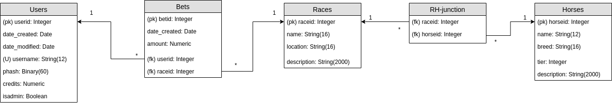

# toto-betting
This repository contains a web app for University of Helsinki's course database app project.

The app can be found on [heroku](https://toto-betting.herokuapp.com/)

[User stories](documentation/docs.md)

[User guide](/documentation/userguide.md)

[Installation guide](/documentation/installguide.md)

## Overview
The idea is to implement toto-betting site where users can place 
bets on horse racing.

**Note** that in the current state the removal of races does 
not work as intended. 

Use these user credentials to gain admin access on heroku:

Username: admin

password: password123

### Database diagram

